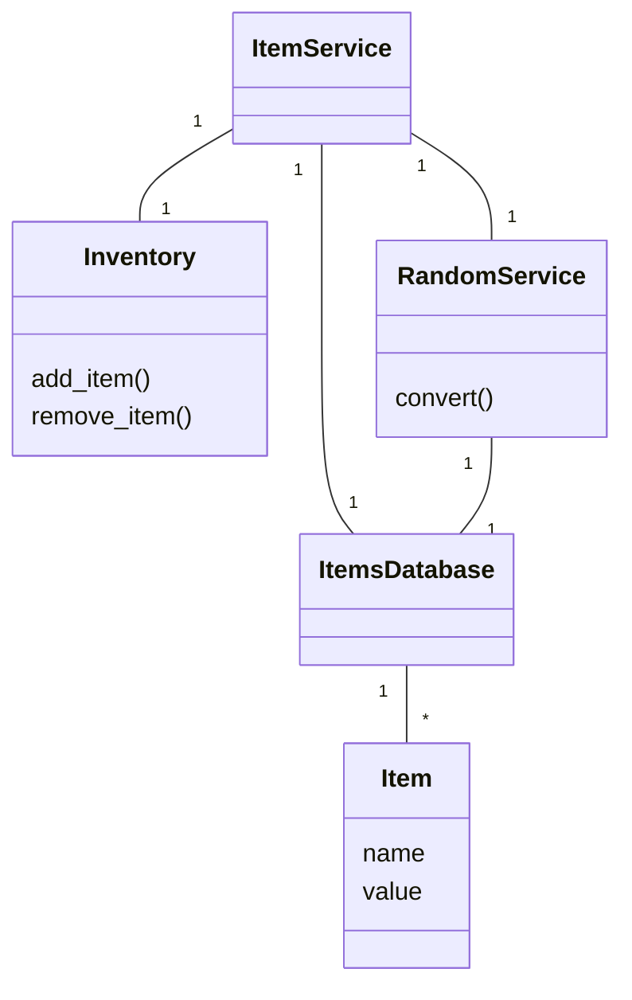
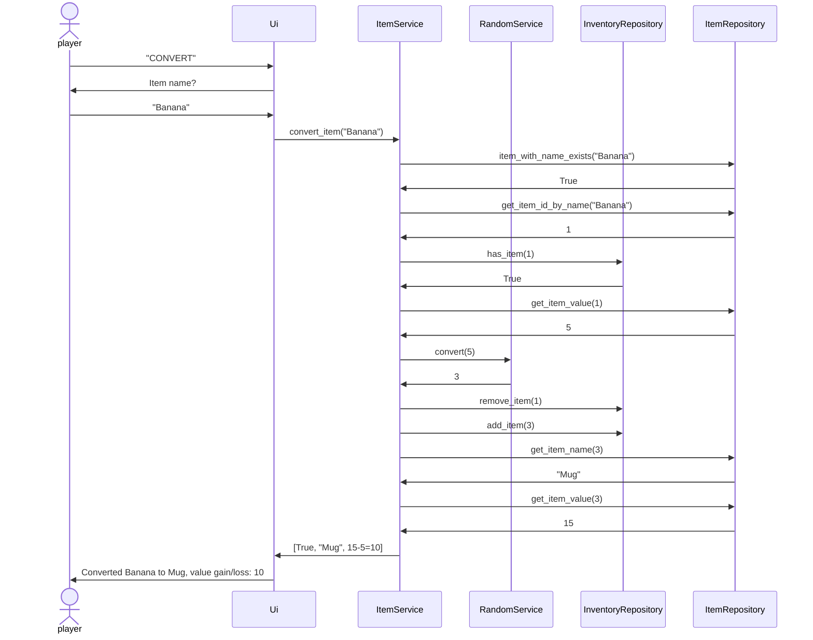

# Alustava luokkakaavio

```mermaid
 classDiagram
    ItemService "1" -- "1" ItemsDatabase
    ItemService "1" -- "1" Inventory
    ItemsDatabase "1" -- "*" Item
    ItemService "1" -- "1" RandomService
    RandomService "1" -- "1" ItemsDatabase
    class Item{
        name
        value
    }
    class ItemsDatabase{
    }
    class RandomService{
        convert()
    }
    class Inventory{
        add_item()
        remove_item()
    }
```

# Sekvenssikaavio tavaran muuntamisesta

```mermaid
sequenceDiagram
    actor player
    participant Ui
    participant ItemService
    participant RandomService
    Participant InventoryRepository
    Participant ItemRepository
    player ->> Ui: "CONVERT"
    Ui ->> player: Item name?
    player ->> Ui: "Banana"
    Ui ->> ItemService: convert_item("Banana")
    ItemService ->> ItemRepository: item_with_name_exists("Banana")
    ItemRepository ->> ItemService: True
    ItemService ->> ItemRepository: get_item_id_by_name("Banana")
    ItemRepository ->> ItemService: 1
    ItemService ->> InventoryRepository: has_item(1)
    InventoryRepository ->> ItemService: True
    ItemService ->> ItemRepository: get_item_value(1)
    ItemRepository ->> ItemService: 5
    ItemService ->> RandomService: convert(5)
    RandomService ->> ItemService: 3
    ItemService ->> InventoryRepository: remove_item(1)
    ItemService ->> InventoryRepository: add_item(3)
    ItemService ->> ItemRepository: get_item_name(3)
    ItemRepository ->> ItemService: "Mug"
    ItemService ->> ItemRepository: get_item_value(3)
    ItemRepository ->> ItemService: 15
    ItemService ->> Ui: [True, "Mug", 15-5=10]
    Ui ->> player: Converted Banana to Mug, value gain/loss: 10

```