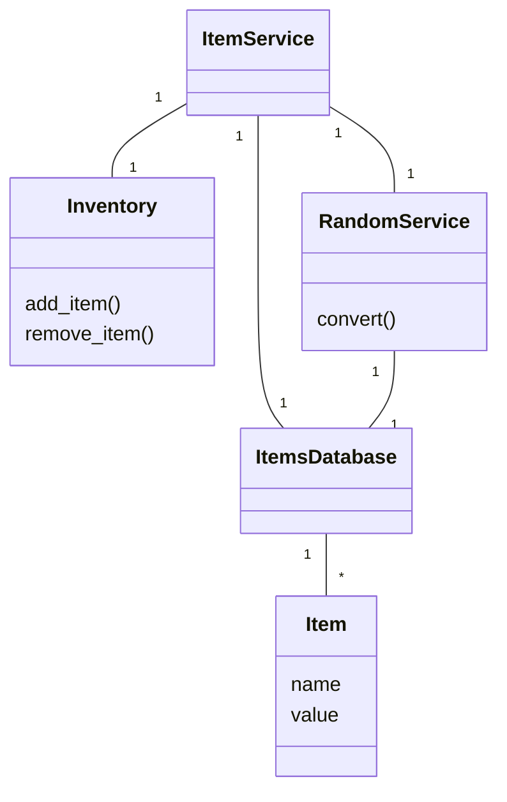

```mermaid
 classDiagram
    ItemService "1" -- "1" ItemsDatabase
    ItemService "1" -- "1" Inventory
    ItemsDatabase "1" -- "*" Item
    ItemService "1" -- "1" RandomService
    RandomService "1" -- "1" ItemsDatabase
    class Item{
        name
        value
    }
    class ItemsDatabase{
    }
    class RandomService{
        convert()
    }
    class Inventory{
        add_item()
        remove_item()
    }
```
