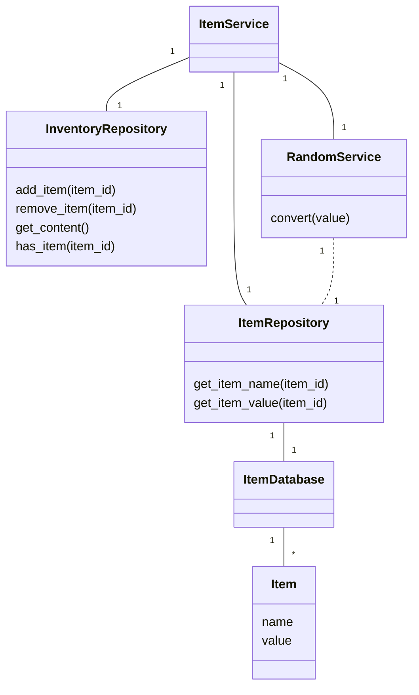
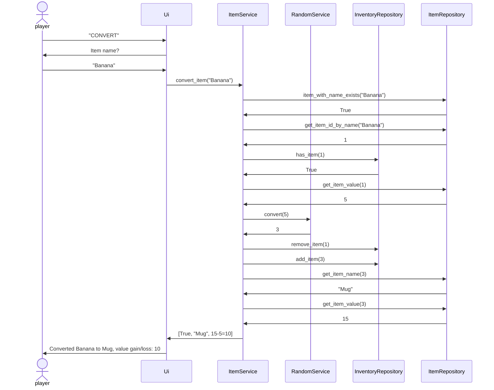

# Arkkitehtuurikuvaus

## Ohjelman rakenne
Ohjelman rakenne koostuu kolmesta tasosta jotka sijaitsevat omissa hakemistoissaan:
- Käyttöliittymä (ui-hakemisto)
- Sovelluslogiikka (services-hakemisto)
- Tietojen tallennus ja haku (repositories-hakemisto)

### Käyttöliittymä
Käyttöliittymä toteuttaa ohjelman käyttöliittymän ja aina tarvittaessa pyytää tietoa sekä lähettää suorituspyyntöjä sovelluslogiikan ItemService-luokalle.  

### Sovelluslogiikka
ItemService-luokka vastaanottaa pyyntöjä sovelluslogiikan suorittamisesta sekä tavaroita ja tavaraluetteloa koskevien tietojen hausta. ItemService kommunikoi muiden sovelluslogiikan luokkien kanssa suorittaakseen pyyntöihin liittyvän sovelluslogiikan ja aina tarvittaessa tietojen hakuun ja tallennukseen lähetetään pyyntöjä repositories-hakemiston luokille. ItemService-luokka lopulta palauttaa käyttöliittymälle käyttöliittymän tarvitsemat pyyntöön liittyvät tiedot.

### Tietojen tallennus ja haku
Repositories-hakemiston luokat vastaavat suorituksen aikaisesta tietojen tallennuksesta ja hausta sekä päivittävät pysyväistallennuksen tiedostoja. Lisäksi ne ylläpitävät entities-hakemiston olioita jotta tietojen hakuun ei aina tarvitse avata tiedostoja. Vain repositories-hakemiston luokat ovat tietoisia olioiden toteutuksesta. Tavaraluettelossa tavaroihin viitataan niitä kuvaavilla luvuilla ja tavaroista saa tietoa vastaavalla luvulla pyytämällä ItemRepository-luokalta.

# Luokkakaavio ohjelman luokista

# Sekvenssikaavio tavaran muuntamisen toteutuksesta
