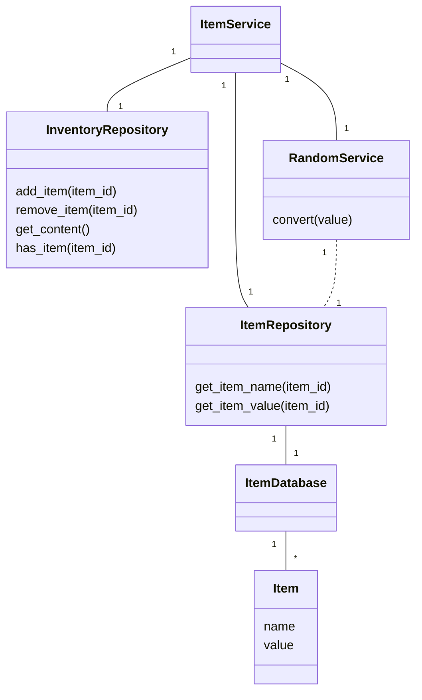
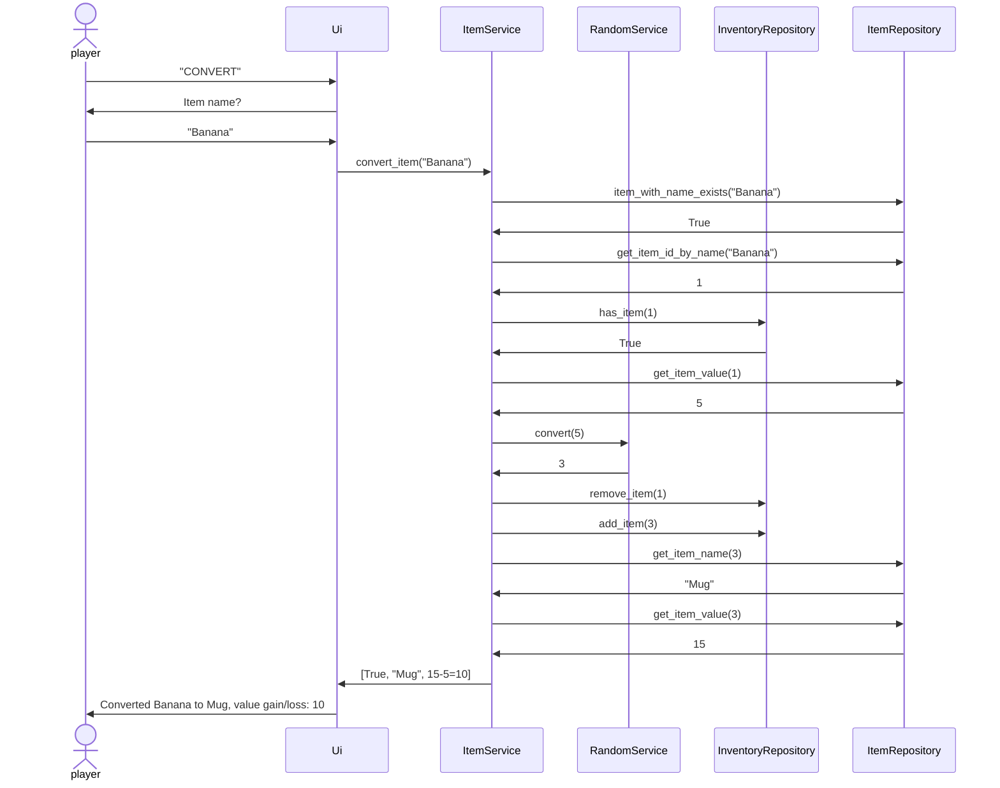

# Arkkitehtuurikuvaus

## Ohjelman rakenne
Ui-hakemiston käyttöliittymä pyytää tietoa sekä lähettää suorituspyyntöjä Services-hakemiston ItemService-luokalle. Services-hakemiston luokat suorittavat pyyntöihin liittyvän sovelluslogiikan ja lähettävät Repositories-hakemiston luokille pyyntöjä tarvittavista haettavista tiedoista sekä tallennettavista tiedoista. Services-hakemiston luokat sitten palauttavat Ui-hakemiston luokille pyydetyt tiedot päivitykset.

## Sovelluslogiikasta
ItemService vastaanottaa pyyntöjä tavaran saamisesta ja muuntamisesta sekä tietojen hakemisesta. Tavaran saamiseen ja muuntamiseen avustaa RandomService ja tietojen hakemiseen Repositories.

# Luokkakaavio

# Sekvenssikaavio tavaran muuntamisesta
