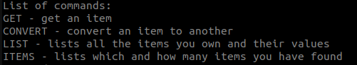
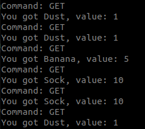
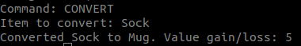
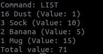
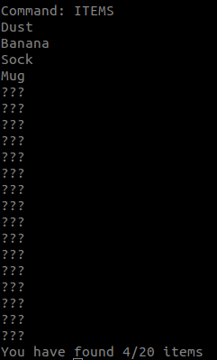

# Käyttöohje

## Asennus
- Lataa projektin lähdekoodi viimeisimmästä [github-releasesta](https://github.com/Joni23452/ot-harjoitustyo/releases). 
- Pura ladattu zip-tiedosto ja siirry komentorivillä projektin juurikansioon.
- Asenna projektin riippuvuudet komennolla ```poetry install```  
- Nyt ohjelman voi käynnistää komennolla ```poetry run invoke start```  

## Ohjelman käyttöohjeet

Sovelluksen käynnistäessä saat listan mahdollisista komennoista joita voit ohjelmalle syöttää.
  

Komentoja voit syöttää aina edellisen komennon suoritettua. Komennot toimivat seuraavasti:
- GET-komennolla saat satunnaisen esineen.  
  
- CONVERT-komennolla voit muuntaa esineen satunnaisesti toiseksi. Komennon syöttämisen jälkeen syötä esineen nimi joka sinulla on ja jonka haluat muuntaa toiseksi.  
  
- LIST-komento listaa omistamasi esineet.  
  
- ITEMS-komento kertoo mitä esineitä olet löytänyt.  
  
- QUIT-komento lopettaa ohjelman suorituksen.

## Muita projektiin liittyviä komentoja
Suoritettava projektin juurikansiosta kun ohjelmaa ei suoriteta ja riippuvuudet on asennettu.
- ```poetry run invoke test``` suorittaa testit  
- ```poetry run invoke coverage-report``` suorittaa testit ja luo testikattavuusraportin tiedostoon htmlcov/index.html  
- ```poetry run invoke lint``` suorittaa pylint-tarkistukset  
