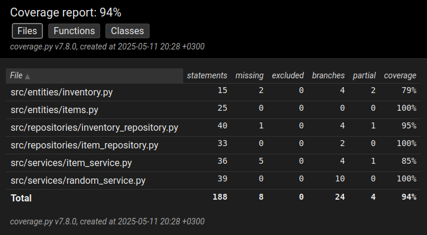

# Testausdokumentti

Ohjelmaa on testattu automatisoiduilla yksikkötesteillä jotka testaavat sekä yksittäisiä luokkia että toiminnallisuuksia jotka hyödyntävät useita luokkia. 

## Mitä on testattu
### Toiminnallisuuksia
- Tavaran saamista
    - Testattu että tavaran saaminen lisää tavaran tavaraluetteloon
- Tavaran muuntamista
    - Testattu että tavaran muuntaminen palauttaa tavaran joka ei ole sama kuin muunnettu tavara
    - Kun tavaraa muunnetaan onnistuneesti tavaraluettelon sisältö muuttuu
    - Kun tavaran muunnos epäonnistuu virheellisen syötteen vuoksi, tavaraluettelo ei muutu

### Yksittäisiä luokkia
- Item ja ItemDatabase luokat
    - Item palauttaa oikeita arvoja
    - ItemDatabase löytää Item-olion nimen perusteella
- Luokkien ItemService, RandomService, ItemRepository ja InventoryRepository toimintaa on testattu toiminnallisuuksien testauksen yhteydessä.

Pysyväistallennusta testaavissa testeissä on käytetty testitiedostoa joka alustetaan näiden testien alussa.

## Testauskattavuus

Aivan kaikkea ei ole testattu, testata olisi voinut vielä enemmän mm. tavaraluettelon äärirajoja.
