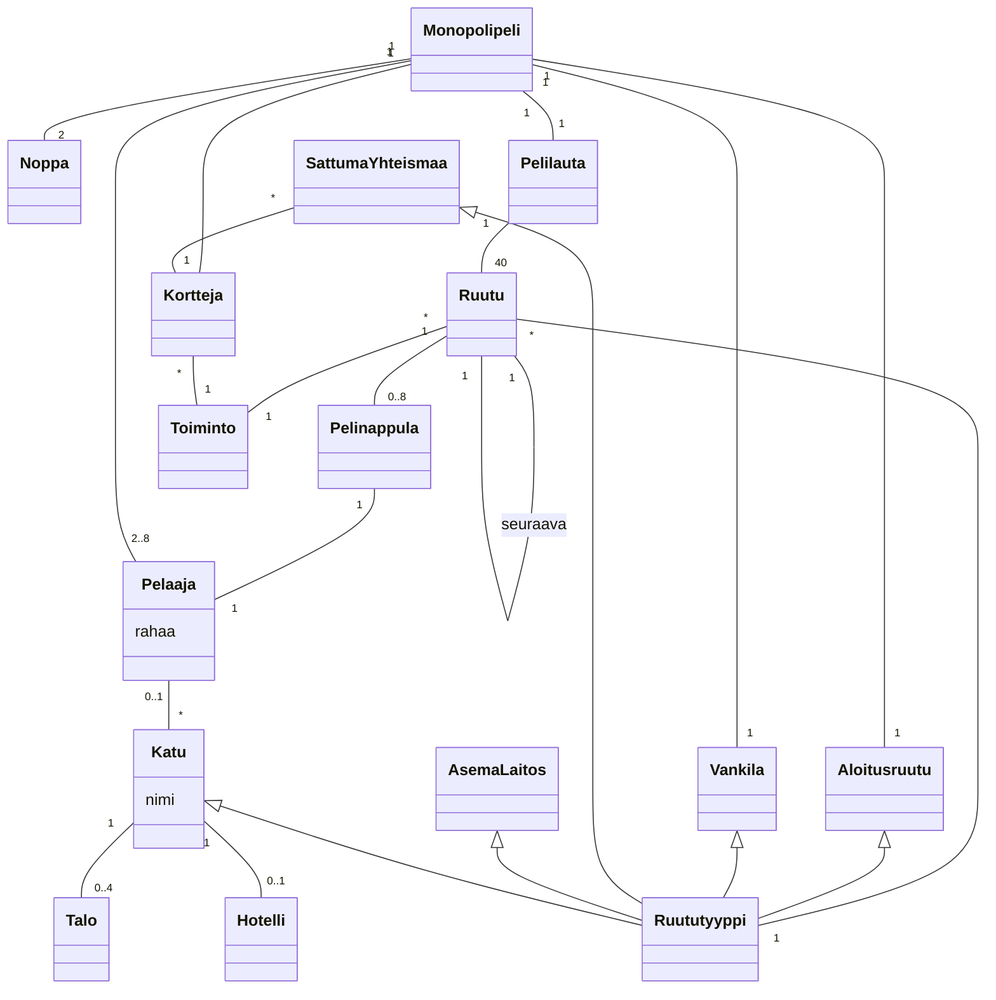

## Monopoli, alustava luokkakaavio, laajennettu

```mermaid
 classDiagram
    Monopolipeli "1" -- "2" Noppa
    Monopolipeli "1" -- "1" Pelilauta
    Pelilauta "1" -- "40" Ruutu
    Ruutu "1" -- "1" Ruutu : seuraava
    Ruutu "1" -- "0..8" Pelinappula
    Pelinappula "1" -- "1" Pelaaja
    Pelaaja "2..8" -- "1" Monopolipeli
    Ruutu "*" -- "1" Ruututyyppi
    Aloitusruutu <|-- Ruututyyppi
    Vankila <|-- Ruututyyppi
    SattumaYhteismaa <|-- Ruututyyppi
    AsemaLaitos <|-- Ruututyyppi
    Katu <|-- Ruututyyppi
    Monopolipeli "1" -- "1" Aloitusruutu
    Monopolipeli "1" -- "1" Vankila
    Ruutu "*" -- "1" Toiminto
    Monopolipeli "1" -- Kortteja
    Kortteja "*" -- "1" Toiminto
    SattumaYhteismaa "*" -- "1" Kortteja
    Pelaaja "0..1" -- "*" Katu
    Katu "1" -- "0..4" Talo
    Katu "1" -- "0..1" Hotelli

    class Katu{
        nimi
    }
    class Pelaaja{
        rahaa
    }
```
